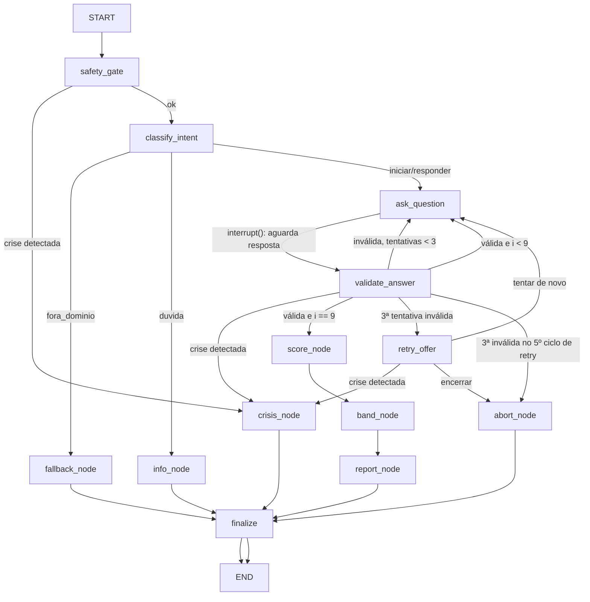

# Jogo Limpo Triagem

[](https://github.com/ernestodeoliveira/jogo-limpo-triagem/actions/workflows/ci.yml)

Agente conversacional de triagem de risco relacionado a apostas, construído com LangGraph. Protótipo do Jogo Limpo Lab.

> Aviso: este projeto é um protótipo educacional de triagem com encaminhamento. Não realiza diagnóstico, não substitui avaliação profissional e não presta aconselhamento clínico.

## 1. Descrição do problema

O Brasil regulamentou as apostas de quota fixa e criou obrigações de jogo responsável, mas continua existindo uma lacuna prática entre a pessoa preocupada com o próprio comportamento de jogo e o recurso de ajuda adequado. A Plataforma Centralizada de Autoexclusão do governo já recebeu centenas de milhares de pedidos, e o motivo mais citado é perda de controle. Faltam pontos de entrada acolhedores que apliquem um instrumento validado, classifiquem o nível de risco e encaminhem para o recurso certo.

## 2. Objetivo do agente

Conduzir uma triagem estruturada em conversa multi-turno: acolher a pessoa, aplicar o questionário PGSI (Problem Gambling Severity Index, 9 itens, instrumento validado), calcular a pontuação por função controlada, classificar a faixa de risco e entregar uma resposta final estruturada com encaminhamentos, além de gravar um relatório em arquivo.

- **Entrada**: mensagens de texto do usuário (respostas em linguagem natural ou na escala 0-3).
- **Saída**: resposta final estruturada (faixa de risco, explicação, encaminhamentos) e relatório em `reports/` gerado por ferramenta.

## 3. Por que é um agente

A solução mantém estado entre turnos (checkpointer com `thread_id`), decide o fluxo por classificação de intenção e regras de segurança (arestas condicionais, incluindo um gate de crise que tem prioridade sobre tudo), usa ferramentas para agir sobre o ambiente (ler dados locais, executar função controlada de score, escrever relatório) e produz saída estruturada verificável.

## 4. Fluxo com LangGraph



O grafo usa `StateGraph` com estado tipado (`TriageState`), nós por etapa e arestas condicionais. O questionário é um ciclo: `ask_question` pausa com `interrupt()` e cada resposta do usuário retoma a execução com `Command(resume=...)`, o que exige checkpointer (`InMemorySaver`) e demonstra memória de sessão. Depois de 3 tentativas inválidas seguidas, `retry_offer` pergunta se a pessoa quer tentar de novo ou encerrar; esse ciclo de oferta tem um limite de 5 repetições (`MAX_RETRY_CYCLES`) antes do encerramento definitivo em `abort_node`. A detecção de crise não roda só na entrada inicial (`safety_gate`): `validate_answer` e `retry_offer` também verificam cada resposta dentro do questionário e podem desviar para `crisis_node` em qualquer ponto do ciclo. Detalhes em `docs/ARCHITECTURE.md`.

## 5. Ferramentas utilizadas pelo agente

| Ferramenta | Tipo | Função no processo |
|---|---|---|
| `load_pgsi_questions()` | leitura de arquivo / dados locais | Carrega e valida os 9 itens de `data/pgsi.json` |
| `compute_pgsi_score(answers)` | função controlada | Valida 9 respostas inteiras 0-3 e calcula o score (0-27) |
| `write_triage_report(result)` | escrita de relatório | Gera `reports/triagem-<thread>-<timestamp>.md` e `.json`; recusa sobrescrever |

## 6. Como executar

Requisitos: Python 3.11+ e [uv](https://docs.astral.sh/uv/).

```bash
git clone https://github.com/ernestodeoliveira/jogo-limpo-triagem
cd jogo-limpo-triagem
uv sync

# Modo 1: com LLM real, via qualquer servidor local OpenAI-compatible
# (ex. oMLX, LM Studio). O .env/.env.example servem só de referência dos
# nomes de variável: NÃO são carregados automaticamente, exporte no shell.
export TRIAGE_LLM_BASE_URL=http://localhost:8000/v1   # endpoint local
export TRIAGE_LLM_MODEL=Qwen3.6-35B-A3B-4bit           # nome do modelo servido
export OPENAI_API_KEY=algum-token                     # só se o endpoint exigir Bearer
uv run python -m triagem.cli

# Modo 2: offline, sem nenhuma variável além desta (FakeLLM determinístico).
# Funciona em máquina limpa, sem endpoint real: é o caminho de demonstração.
TRIAGE_FAKE_LLM=1 uv run python -m triagem.cli

# Testes (rodam sem chave de API)
uv run pytest -v
```

## 7. Exemplo de entrada

Trecho real da sessão de risco baixo (`examples/risco-baixo.md`, modo LLM real):

```
Agente: Olá! Sou o agente de triagem do Jogo Limpo Lab. Aplico o questionário PGSI, com 9 perguntas sobre os últimos 12 meses, e indico uma faixa educacional de risco com encaminhamentos. Não é diagnóstico. Nesta sessão eu respondo a uma única mensagem inicial: diga 'quero começar' para iniciar a triagem agora, ou faça uma pergunta sobre o teste (nesse caso a sessão termina em seguida, e você precisa rodar de novo para começar a triagem).

Você: quero começar

Agente:
Pergunta 1 de 9: Você apostou mais do que realmente poderia perder?
Escala: 0 = Nunca, 1 = Às vezes, 2 = Na maioria das vezes, 3 = Quase sempre

Você: às vezes

...

Você: nunca
```

Exemplos completos de execução (baixo, moderado e cenário de crise) em `examples/`.

## 8. Exemplo de saída

Saída final real da mesma sessão de risco baixo:

```
Resultado da triagem PGSI: risco baixo, pontuação 2 de 27.

Suas respostas indicam um risco baixo relacionado a apostas. Pode ser útil observar se o seu padrão de uso muda com o tempo.

Encaminhamentos:
- Plataforma centralizada de autoexclusão de apostas: gov.br
- CVV: ligue 188, gratuito, 24 horas por dia, todos os dias
- Rede CAPS/SUS: procure a unidade de saúde mais próxima

Este resultado é uma triagem educacional e não constitui diagnóstico nem substitui avaliação profissional.

Relatório gravado em: reports/triagem-19777a42322a42e98deb9edcfbc4d31b-20260718T095924.md
```

O relatório correspondente está versionado como exemplo em `reports/sample-triagem-19777a42322a42e98deb9edcfbc4d31b-20260718T095924.md` (e o `.json` equivalente).

## 9. Principais decisões

1. Repositório do zero (padrões de referência foram recriados no domínio da triagem, não copiados; ver referências).
2. Ciclo do questionário com `interrupt()`/`Command(resume=...)` e checkpointer, com plano B por turno documentado.
3. Parser determinístico de respostas antes do LLM; LLM só como fallback com saída estruturada.
4. Gate de crise com prioridade sobre qualquer intenção: em sinal de emergência, o questionário para e o agente entrega os canais de ajuda.
5. Modo offline com FakeLLM para execução e testes sem chave de API.
6. O relatório inclui as 9 respostas usadas no cálculo: quem redige não calcula, a saída é verificável.

Racional completo em `docs/DECISIONS.md`.

## 10. Limitações

- Não é diagnóstico nem dispositivo médico; é triagem educacional com encaminhamento.
- Detecção de crise por heurística + classificação simples; pode ter falsos negativos e falsos positivos.
- `InMemorySaver` não persiste entre processos (sessão vive enquanto o CLI roda).
- Apenas PT-BR.
- Interface por terminal (CLI); sem interface web.

## 11. Segurança e privacidade

- Nenhuma chave ou segredo versionado; `.env` no `.gitignore`; `.env.example` só com nomes de variáveis.
- Nenhum dado pessoal real: sessões identificadas apenas por `thread_id` aleatório.
- Entradas do usuário tratadas como dados, nunca interpoladas em prompts de sistema (mitigação de prompt injection).
- Respostas fora do formato são rejeitadas com re-pergunta (máx. 3 tentativas por item).
- Tracing LangSmith/LangChain desabilitado por padrão pelo CLI (`LANGSMITH_TRACING`, `LANGCHAIN_TRACING_V2`, `LANGSMITH_TRACING_V2` e `LANGCHAIN_TRACING`), mesmo que já estejam definidas no shell ou no `.env`: nenhuma conversa é enviada para a nuvem sem escolha explícita. Para habilitar tracing, defina `TRIAGE_ALLOW_TRACING=1`.
- Proveniência do modelo local (modo LLM real): a execução é 100% local, nenhum dado sai da máquina. Pesos baixados do Hugging Face, repositório `mlx-community/Qwen3.6-35B-A3B-4bit`, revisão `38740b847e4cb78f352aba30aa41c76e08e6eb46`, em 12/07/2026; servidos pelo oMLX 0.5.1 (build 1878), aplicativo macOS com API OpenAI-compatible em `http://localhost:8000/v1`. O servidor exige token Bearer local, fornecido via `OPENAI_API_KEY`; o valor nunca é versionado. SHA-256 dos 4 shards de pesos, computados localmente em 18/07/2026 com `shasum -a 256`:
  - `model-00001-of-00004.safetensors`: `09f3e6ecb0b7af6e6a38bc8169a134c821b0924c2679b2bb8f4426ad38d032b8`
  - `model-00002-of-00004.safetensors`: `31dcdb1c49eebdb1505bd14e3cb33f9cf900bd2546b638f2464694ae763a033f`
  - `model-00003-of-00004.safetensors`: `3e66de06a1f03dade16a612a368cfce4a4c9caa4efd7d28185454384082cec03`
  - `model-00004-of-00004.safetensors`: `a5d0cf03519c26f8b506df6b0ba60526e5c08c8cea22d0c21ce92950e58a5422`

## 12. Referências e atribuição

- PGSI: itens do Canadian Problem Gambling Index (Ferris & Wynne, 2001), instrumento de uso livre com atribuição. Os itens em `data/pgsi.json` seguem a versão brasileira com adaptação transcultural e validade de conteúdo (Moura et al., 2026), com fonte citada no próprio arquivo.
- Padrões de LangGraph (structured output, fakes de teste, checkpointer, interrupt) inspirados no repositório `stack-sentinel-senai`, de Caio Prá, usado como referência de padrões.
- Recursos de apoio citados pelo agente: gov.br/autoexclusaoapostas, CVV 188, rede CAPS/SUS.

## 13. Estrutura do repositório

```
├── README.md
├── pyproject.toml
├── uv.lock
├── .env.example
├── .github/workflows/ci.yml
├── data/pgsi.json
├── docs/          # PRD, ARCHITECTURE, DECISIONS, prompts.md, slides.md + planos (PLAN, CI_PLAN, OWASP_LLM_AUDIT_PLAN, PARSER_HARDENING_PLAN, RELEASE_PLAN, TEST_AUDIT_PLAN)
├── examples/      # transcritos reais: risco-baixo.md, risco-moderado.md, crise.md
├── reports/       # relatórios gerados pela ferramenta (exemplo versionado: sample-triagem-*.md/.json)
├── src/triagem/   # state, classify, safety, parsing, tools, nodes, graph, fakes, cli
└── tests/
```
