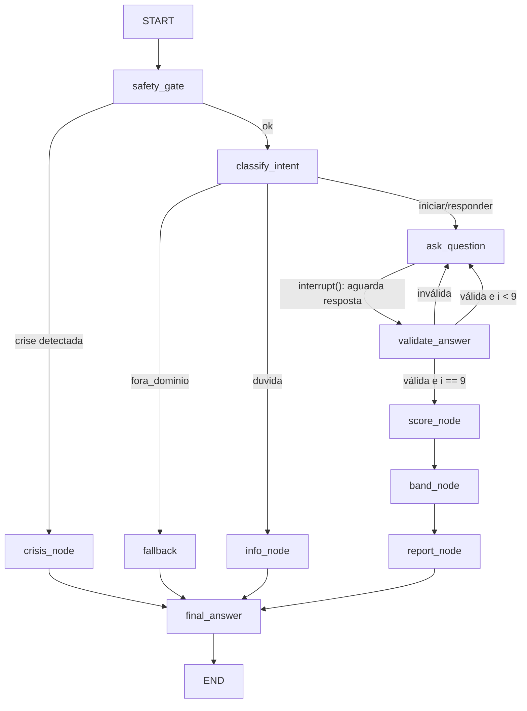

# Jogo Limpo Triagem

Agente conversacional de triagem de risco relacionado a apostas, construído com LangGraph. Protótipo do Jogo Limpo Lab.

> Aviso: este projeto é um protótipo educacional de triagem com encaminhamento. Não realiza diagnóstico, não substitui avaliação profissional e não presta aconselhamento clínico.

## 1. Descrição do problema

O Brasil regulamentou as apostas de quota fixa e criou obrigações de jogo responsável, mas continua existindo uma lacuna prática entre a pessoa preocupada com o próprio comportamento de jogo e o recurso de ajuda adequado. A Plataforma Centralizada de Autoexclusão do governo já recebeu centenas de milhares de pedidos, e o motivo mais citado é perda de controle. Faltam pontos de entrada acolhedores que apliquem um instrumento validado, classifiquem o nível de risco e encaminhem para o recurso certo.

## 2. Objetivo do agente

Conduzir uma triagem estruturada em conversa multi-turno: acolher a pessoa, aplicar o questionário PGSI (Problem Gambling Severity Index, 9 itens, instrumento validado), calcular a pontuação por função controlada, classificar a faixa de risco e entregar uma resposta final estruturada com encaminhamentos, além de gravar um relatório em arquivo.

- **Entrada**: mensagens de texto do usuário (respostas em linguagem natural ou na escala 0-3).
- **Saída**: resposta final estruturada (faixa de risco, explicação, encaminhamentos) e relatório em `reports/` gerado por ferramenta.

## 3. Por que é um agente

A solução mantém estado entre turnos (checkpointer com `thread_id`), decide o fluxo por classificação de intenção e regras de segurança (arestas condicionais, incluindo um gate de crise que tem prioridade sobre tudo), usa ferramentas para agir sobre o ambiente (ler dados locais, executar função controlada de score, escrever relatório) e produz saída estruturada verificável.

## 4. Fluxo com LangGraph



O grafo usa `StateGraph` com estado tipado (`TriageState`), nós por etapa e arestas condicionais. O questionário é um ciclo: `ask_question` pausa com `interrupt()` e cada resposta do usuário retoma a execução com `Command(resume=...)`, o que exige checkpointer (`InMemorySaver`) e demonstra memória de sessão. Detalhes em `docs/ARCHITECTURE.md`.

## 5. Ferramentas utilizadas pelo agente

| Ferramenta | Tipo | Função no processo |
|---|---|---|
| `load_pgsi_questions()` | leitura de arquivo / dados locais | Carrega e valida os 9 itens de `data/pgsi.json` |
| `compute_pgsi_score(answers)` | função controlada | Valida 9 respostas inteiras 0-3 e calcula o score (0-27) |
| `write_triage_report(result)` | escrita de relatório | Gera `reports/triagem-<thread>-<timestamp>.md` e `.json`; recusa sobrescrever |

## 6. Como executar

Requisitos: Python 3.11+ e [uv](https://docs.astral.sh/uv/).

```bash
git clone https://github.com/ernestodeoliveira/jogo-limpo-triagem
cd jogo-limpo-triagem
uv sync

# Modo 1: com LLM real (Gemini)
cp .env.example .env          # e preencha GOOGLE_API_KEY
uv run python -m triagem.cli

# Modo 2: offline, sem nenhuma chave (FakeLLM determinístico)
TRIAGE_FAKE_LLM=1 uv run python -m triagem.cli

# Testes (rodam sem chave de API)
uv run pytest -v
```

## 7. Exemplo de entrada

<!-- SUBSTITUIR pelos transcritos reais da sua execução antes de publicar -->

```
Você: quero fazer o teste
Agente: [acolhimento + explicação da escala] Pergunta 1 de 9: ...
Você: às vezes
Agente: Pergunta 2 de 9: ...
Você: 0
...
Você: nunca
```

## 8. Exemplo de saída

<!-- SUBSTITUIR pela saída real gerada (cole o conteúdo de um relatório de reports/) -->

```
Resultado da triagem
Faixa: risco baixo (score 2 de 27)
[explicação da faixa]
Encaminhamentos: Plataforma Centralizada de Autoexclusão (gov.br/autoexclusaoapostas),
CVV 188 (24h), rede CAPS/SUS.
Este resultado é uma triagem educacional e não constitui diagnóstico.
Relatório gravado em: reports/triagem-abc123-20260718T2010.md
```

Exemplos completos de execução (baixo, moderado e cenário de crise) em `examples/`.

## 9. Principais decisões

1. Repositório do zero (padrões de referência foram recriados no domínio da triagem, não copiados; ver referências).
2. Ciclo do questionário com `interrupt()`/`Command(resume=...)` e checkpointer, com plano B por turno documentado.
3. Parser determinístico de respostas antes do LLM; LLM só como fallback com saída estruturada.
4. Gate de crise com prioridade sobre qualquer intenção: em sinal de emergência, o questionário para e o agente entrega os canais de ajuda.
5. Modo offline com FakeLLM para execução e testes sem chave de API.
6. O relatório inclui as 9 respostas usadas no cálculo: quem redige não calcula, a saída é verificável.

Racional completo em `docs/DECISIONS.md`.

## 10. Limitações

- Não é diagnóstico nem dispositivo médico; é triagem educacional com encaminhamento.
- Detecção de crise por heurística + classificação simples; pode ter falsos negativos e falsos positivos.
- `InMemorySaver` não persiste entre processos (sessão vive enquanto o CLI roda).
- Apenas PT-BR.
- Interface por terminal (CLI); sem interface web.

## 11. Segurança e privacidade

- Nenhuma chave ou segredo versionado; `.env` no `.gitignore`; `.env.example` só com nomes de variáveis.
- Nenhum dado pessoal real: sessões identificadas apenas por `thread_id` aleatório.
- Entradas do usuário tratadas como dados, nunca interpoladas em prompts de sistema (mitigação de prompt injection).
- Respostas fora do formato são rejeitadas com re-pergunta (máx. 3 tentativas por item).

## 12. Referências e atribuição

- PGSI: itens do Canadian Problem Gambling Index (Ferris & Wynne, 2001), instrumento de uso livre com atribuição. Os itens em `data/pgsi.json` seguem a versão validada em português (fonte citada no próprio arquivo).
- Padrões de LangGraph (structured output, fakes de teste, checkpointer, interrupt) inspirados no repositório `stack-sentinel-senai`, de Caio Prá, usado como referência de padrões.
- Recursos de apoio citados pelo agente: gov.br/autoexclusaoapostas, CVV 188, rede CAPS/SUS.

## 13. Estrutura do repositório

```
├── README.md
├── pyproject.toml
├── .env.example
├── data/pgsi.json
├── docs/          # PRD, ARCHITECTURE, DECISIONS, prompts.md, slides.md, PLAN.md
├── examples/      # transcritos de entrada e saída
├── reports/       # relatórios gerados pela ferramenta (1 exemplo versionado)
├── src/triagem/   # state, classify, safety, parsing, tools, nodes, graph, fakes, cli
└── tests/
```
