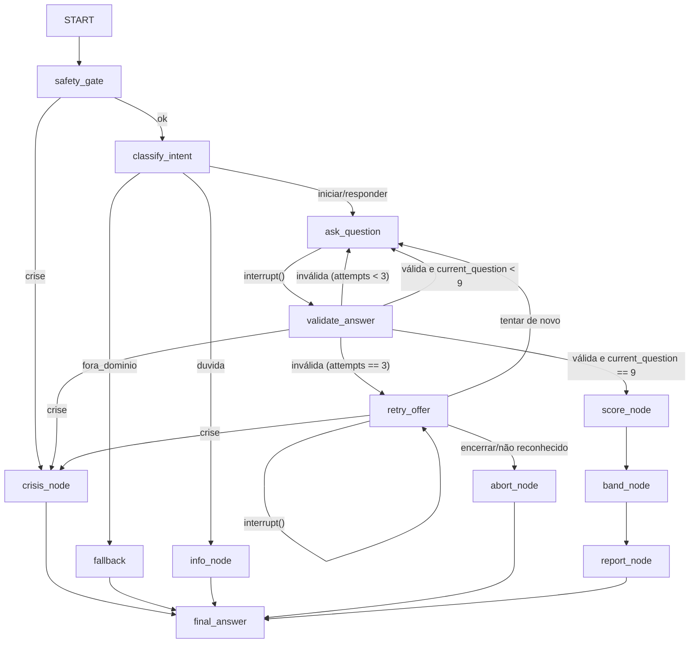

# ARCHITECTURE: Agente de Triagem PGSI

Status: Aprovado para implementação. Convenções: documentação em PT-BR; código, identificadores e nomes de arquivos em inglês.

## 1. Visão geral

Agente conversacional em LangGraph, executado por CLI, com três camadas: (1) segurança e roteamento (gate de crise + intenção), (2) ciclo do questionário com memória de sessão, (3) ferramentas e saída estruturada. Sem serviços externos além do LLM (e nem ele, no modo offline).

## 2. Estado

```python
import operator
from typing import Annotated, Literal, TypedDict

class TriageState(TypedDict):
    user_input: str
    intent: Literal["iniciar", "responder", "duvida", "fora_dominio"] | None
    phase: Literal["acolhimento", "triagem", "crise", "resultado"] | None
    current_question: int                      # 0..9 (índice do próximo item; 9 = questionário completo)
    attempts: int                              # tentativas inválidas no item atual
    answers: Annotated[dict, operator.or_]     # {"q1": 2, ...} reducer de merge
    crisis_flag: bool
    score: int | None
    severity_band: Literal["sem_risco", "baixo", "moderado", "alto"] | None
    report_path: str | None
    final_answer: str | None
    error: str | None
```

Padrões herdados do repositório de referência (stack-sentinel): TypedDict + reducer `operator.or_` para não sobrescrever o acumulado; `final_answer` como canal único de saída.

## 3. Grafo



Crise tem precedência absoluta (D-04): `safety_gate` checa a mensagem inicial antes de qualquer classificação de intenção; `validate_answer` e `retry_offer` checam cada resposta retomada via `Command(resume=...)` antes de interpretá-la (Q4), inclusive quando a pessoa está no meio da oferta de tentar de novo/encerrar. Em qualquer um dos três pontos, detecção de crise desvia direto para `crisis_node`, que por sua vez alimenta `finalize` (`final_answer` já vem pronto, `finalize_node` só repassa).

### Tabela de nós

| Nó | Tipo | Responsabilidade |
|---|---|---|
| `safety_gate` | determinístico | Heurística de termos de emergência (`CRISIS_TERMS`/`check_crisis` em `safety.py`); seta `crisis_flag` antes de qualquer classificação de intenção |
| `crisis_node` | determinístico | Mensagem de acolhimento + CVV 188 + SAMU 192 + orientação; encerra a triagem da sessão via `finalize` |
| `classify_intent` | LLM structured output | `IntentResult` (Pydantic, `Literal`), padrão do `classify.py` de referência |
| `info_node` | determinístico | Explica o teste, a escala e a privacidade (conteúdo estático) |
| `ask_question` | determinístico + `interrupt()` | Entrega o item atual com escala; pausa aguardando resposta |
| `validate_answer` | determinístico + LLM fallback | Checa crise antes do parser (Q4/D-04) e roteia para `crisis_node` se detectada; parser 0-3; controla `attempts`; grava em `answers`; avança `current_question` |
| `retry_offer` | determinístico + `interrupt()` | Após 3 tentativas inválidas, oferece tentar de novo ou encerrar; idempotente antes do `interrupt()` (D-09/R-02); checa crise na resposta retomada com precedência sobre a lógica de tentar/encerrar, sem resetar `attempts` (D-04); reseta `attempts` só na resposta que escolhe tentar de novo |
| `abort_node` | determinístico | Encerramento educado após a pessoa optar por encerrar (ou resposta não reconhecida à oferta), com recursos |
| `score_node` | ferramenta | `compute_pgsi_score(answers)` |
| `band_node` | determinístico | Score → faixa (0; 1-2; 3-7; 8-27) |
| `report_node` | ferramenta | `write_triage_report(...)`; guarda `report_path` |
| `fallback_node` | determinístico | Fora de domínio: redireciona gentilmente ao propósito do agente |
| `final_answer` | determinístico | Monta a saída estruturada final (nenhum número vem de LLM) |

## 4. Multi-turno: decisão A/B

**A (principal)**: `interrupt()` dentro de `ask_question`; o CLI retoma com `Command(resume=texto)`. Exige `compile(checkpointer=InMemorySaver())` e `config={"configurable": {"thread_id": ...}}`. É o padrão idiomático de human-in-the-loop do LangGraph e evidencia a memória de sessão.

**B (fallback)**: um `invoke` por mensagem, mesmo `thread_id`, roteando pela `phase`. Migrar para B se A não estiver estável após 2 h de tentativa no dia 14 (registrado no PRD §8).

Esqueleto do CLI (opção A):

```python
cfg = {"configurable": {"thread_id": session_id}}
result = app.invoke(initial_state(first_message), cfg)
while "__interrupt__" in result:
    payload = result["__interrupt__"][0].value      # pergunta atual
    print(render_question(payload))
    user_text = input("Você: ")
    result = app.invoke(Command(resume=user_text), cfg)
print(result["final_answer"])
```

## 5. Parsing de respostas (determinístico primeiro)

| Entrada aceita (case-insensitive, sem acento) | Valor |
|---|---|
| "0", "nunca", "nao", "jamais" | 0 |
| "1", "as vezes", "às vezes", "raramente", "de vez em quando" | 1 |
| "2", "na maioria das vezes", "frequentemente" | 2 |
| "3", "quase sempre", "sempre", "toda vez" | 3 |

Regras: normalizar (lower + strip + remover acentos); match exato da string normalizada completa; ambíguo ou fora da tabela → inválido. Se inválido, e somente então, fallback LLM com `with_structured_output` restrito a `Literal[0, 1, 2, 3] | None` (None = não interpretável). Instrução embutida na resposta é inválida por definição: o parser não "obedece" texto.

## 6. Ferramentas (contratos)

```python
def load_pgsi_questions(path: str = "data/pgsi.json") -> list[Question]:
    """Lê e valida: exatamente 9 itens, cada um com id (q1..q9) e text não vazio.
    Levanta PGSIDataError com mensagem clara se malformado."""

class ScoreResult(BaseModel):
    score: int          # 0..27
    answers: dict[str, int]

def compute_pgsi_score(answers: dict[str, int]) -> ScoreResult:
    """Exige chaves q1..q9, valores int 0..3. Pura, sem I/O. ValueError se violar."""

def write_triage_report(result: TriageOutcome, out_dir: str = "reports") -> str:
    """Gera .md e .json com timestamp; recusa sobrescrever; retorna o caminho do .md."""
```

`TriageOutcome` (Pydantic): `thread_id`, `timestamp`, `score`, `severity_band`, `answers`, `referrals` (lista fixa), `disclaimer`.

## 7. Segurança

- Prompts de sistema estáticos; conteúdo do usuário só como mensagem de usuário/dado (mitigação de prompt injection: instrução embutida em dado não é obedecida).
- Modo offline: `TRIAGE_FAKE_LLM=1` injeta `FakeClassifier`/`FakeAnswerParser` (padrão `fakes.py` do repo de referência: mesma interface `with_structured_output`/`invoke`).
- Segredos via `.env` (python-dotenv ou leitura direta de `os.environ`); `.env.example` sem valores.
- Relatórios não contêm dado pessoal: apenas `thread_id` aleatório, respostas e faixa.

## 8. Testes

| Arquivo | Cobre |
|---|---|
| `test_score.py` | Faixas nas bordas (0, 1, 2, 3, 7, 8, 27); falta de item; valor fora de 0-3; propriedade score ∈ [0, 27] |
| `test_parsing.py` | Tabela da §5 completa; entradas ambíguas; tentativa de injeção como inválida |
| `test_safety.py` | Frases de crise acionam a rota; frases neutras não acionam (FakeLLM) |
| `test_routing.py` | Intenção → nó; `fora_dominio` → fallback; crise tem precedência sobre intenção |
| `test_report.py` | Escrita em `tmp_path`; conteúdo com as 9 respostas e a faixa; recusa overwrite |
| `test_graph_e2e.py` | Triagem completa com FakeLLM: 9 resumes → score → relatório → final_answer |

Todos rodam sem chave de API (fakes injetados por env/fixture, como no repo de referência).

## 9. Configuração

| Variável | Uso |
|---|---|
| `GOOGLE_API_KEY` | Gemini via `langchain[google-genai]` (opcional se offline) |
| `TRIAGE_FAKE_LLM` | `1` = fakes determinísticos em CLI e testes |
| `TRIAGE_REPORTS_DIR` | Default `reports/` |

## 10. Layout do código

```
src/triagem/
├── state.py      # TriageState
├── classify.py   # IntentResult + classify_intent_node
├── safety.py     # heurística + safety_gate_node + crisis content
├── parsing.py    # normalização + tabela + fallback LLM
├── tools.py      # load_pgsi_questions, compute_pgsi_score, write_triage_report
├── nodes.py      # demais nós
├── graph.py      # build_agent(llm) + initial_state()
├── fakes.py      # FakeClassifier, FakeAnswerParser
└── cli.py        # loop de sessão com thread_id
```
